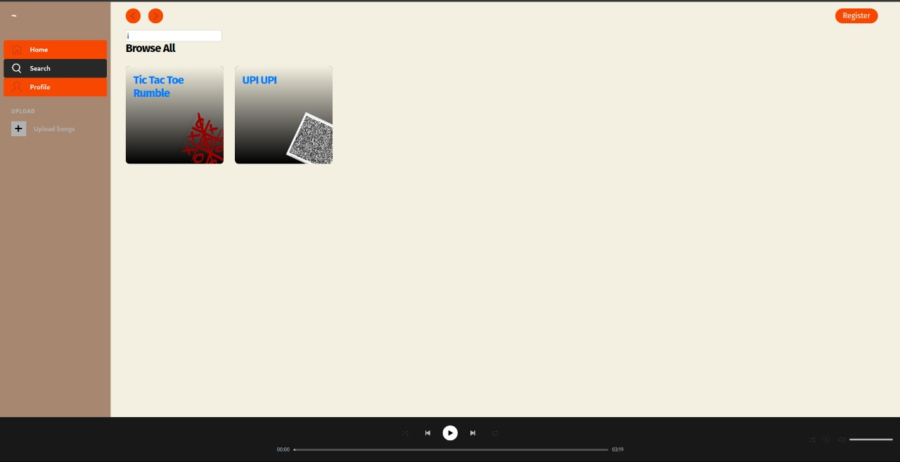

# Canary - DecenMusic
<div align="center">

</div>
Built by the team named Canary for CodeShastra 8.0 Hackathon. This is a decentralized music application built with the help of IPFS for hosting the music libraries in a decentralized manner. React was used to build the web page.

## How to build the web page?

Install the packages by running the `npm install` command in the `web-player` directory.

Then `npm run build` is used to build the web page using React and `npm run start` is used to start the application.

## How to configure and host the backend server?

Run `npm install` in the path `/backend/api` to install the packages required for the backend server. Create an `.env` file sample in this manner -

```.env
PORT=5000
DB_STRING=< database link>
```

These settings can be found in `config.js`.

## Future Scope
- A better way for copyright protection is to be implemented.
- An earning incentive for the song artists has to be introduced.